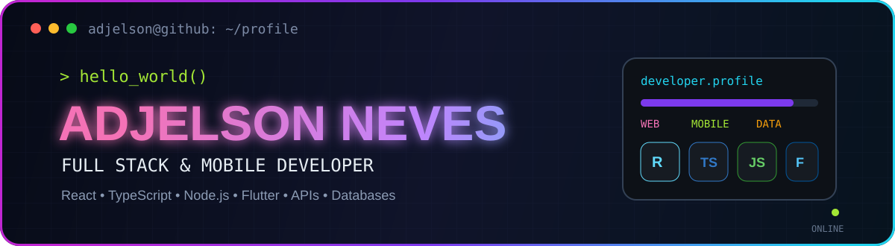
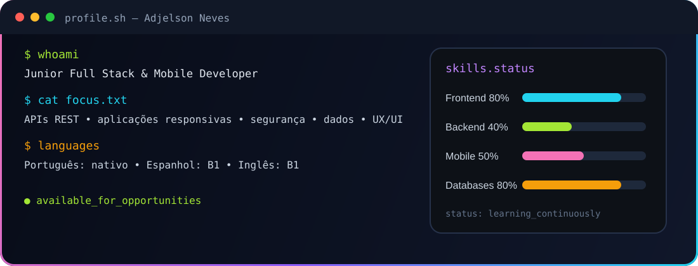

---

## `01. SOBRE_MIM`

Sou licenciado em **Engenharia Informática** e tenho experiência prática no desenvolvimento de aplicações web full-stack, aplicações mobile, APIs REST e sistemas orientados à gestão e ao processamento de dados.

<table>
<tr>
<td width="50%" valign="top">

### 💻 Desenvolvimento

- Frontend com **React, Next.js, Angular e TypeScript**
- Backend com **Node.js, Express, Spring Boot, Laravel e PHP**
- Mobile com **Flutter e React Native**
- Interfaces responsivas e componentes reutilizáveis

</td>
<td width="50%" valign="top">

### 🎯 Foco profissional

- Arquitetura de APIs REST
- Segurança, autenticação e auditoria
- Modelação de bases de dados
- Acessibilidade e usabilidade
- Clean Code e aprendizagem contínua

</td>
</tr>
</table>

---

## `02. STACK_TECNOLÓGICA`

### Linguagens, frameworks e ferramentas

<strong>📦 Ver stack detalhada</strong>

 

| Área | Tecnologias |
|---|---|
| **Frontend** | React, Next.js, Angular, TypeScript, JavaScript, Tailwind CSS, Bootstrap |
| **Mobile** | Flutter, React Native, Expo, React Navigation, Zustand |
| **Backend** | Node.js, Express, Spring Boot, Laravel, PHP, REST APIs, JWT |
| **Dados** | PostgreSQL, MySQL, MariaDB, SQLite, Prisma ORM, SQL |
| **DevOps** | Docker, Git, GitHub, GitLab, Linux, Postman |
| **Qualidade** | Clean Code, testes, validação, segurança, acessibilidade e UX/UI |

---

## `04. GITHUB_DASHBOARD`

### Gráfico de atividade

---

## `05. EXPERIÊNCIA`

<table>
<tr>
<td width="50%" valign="top">

### 🏛️ Instituto Nacional de Estatística

- Desenvolvimento de aplicações full-stack
- React, Node.js, TypeScript e MySQL
- APIs REST e validação de dados
- Sistemas para operações estatísticas
- Manutenção evolutiva e corretiva

</td>
<td width="50%" valign="top">

### 🗂️ Registos e Serviços Notariais

- Desenvolvimento frontend
- Next.js, Tailwind CSS e Bootstrap
- Interfaces responsivas
- Componentes reutilizáveis
- Melhoria de acessibilidade e UX/UI

</td>
</tr>
</table>

---

## `06. CONTACTO`

### Vamos construir algo útil? 🚀

Estou disponível para colaborar em projetos web e mobile, integrar equipas de desenvolvimento e enfrentar novos desafios profissionais.

 

